# Graphs Used by the Unit Tests

## Topological Sort

### TestTopologicalSort.test_topological_sort_returns_vertices_in_proper_order_case_01
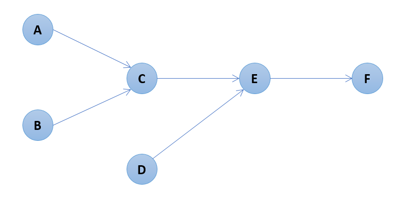

### TestTopologicalSort.test_topological_sort_returns_vertices_in_proper_order_case_02
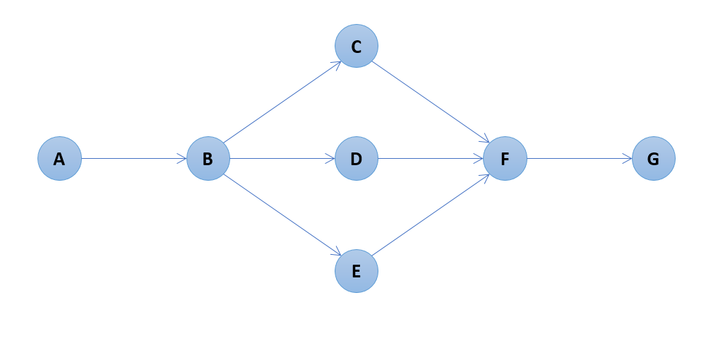

### TestTopologicalSort.test_topological_sort_returns_vertices_in_proper_order_case_03
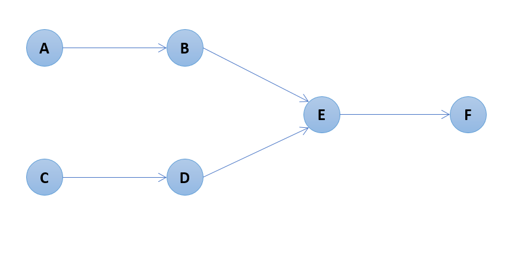

### TestTopologicalSort.test_topological_sort_returns_vertices_in_proper_order_case_04
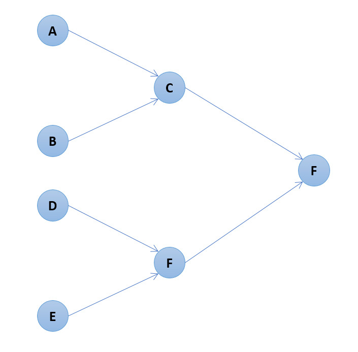

## Shortest Path Algorithm

### Unweighted Graphs

#### TestShortestPathSearchForUnweightedGraphSuiteOne

#### TestShortestPathSearchForUnweightedGraphSuiteTwo
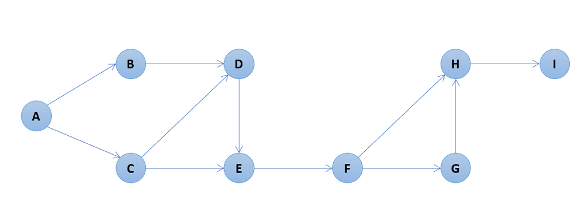

#### TestShortestPathSearchForUnweightedGraphSuiteThree
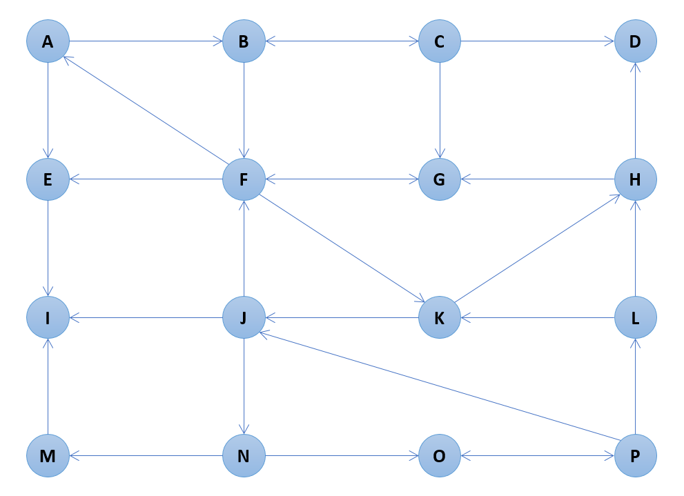

### Weighted Graphs

#### TestShortestPathSearchForWeightedGraphSuiteOne
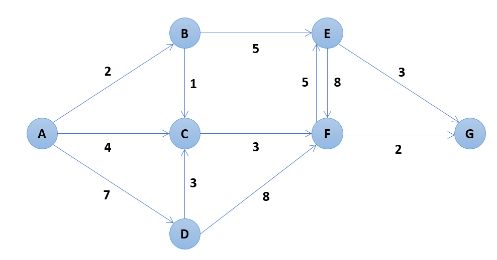

#### TestShortestPathSearchForWeightedGraphSuiteTwo
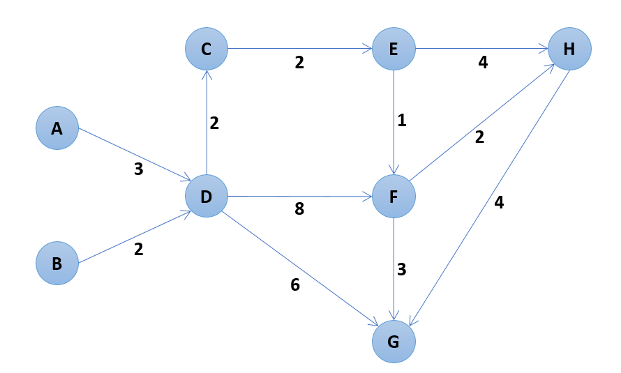

#### TestShortestPathSearchForWeightedGraphSuiteThree
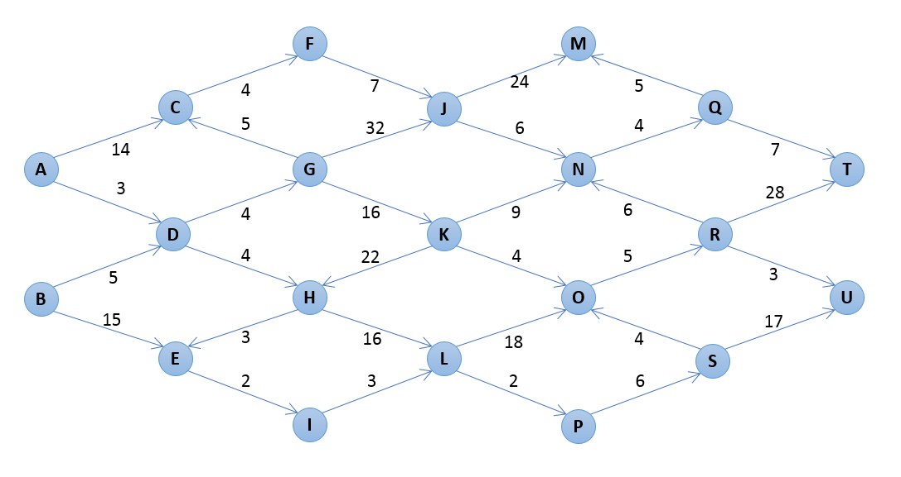

#### TestShortestPathSearchForWeightedGraphSuiteFour
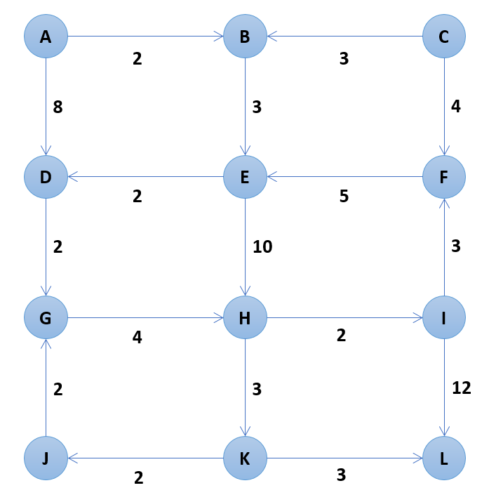

## Minimum Spanning Tree

### Prim's Algorithm

#### TestMinimumSpanningTreeSearch.test_prims_algorithm_01 (starting vertex = A)
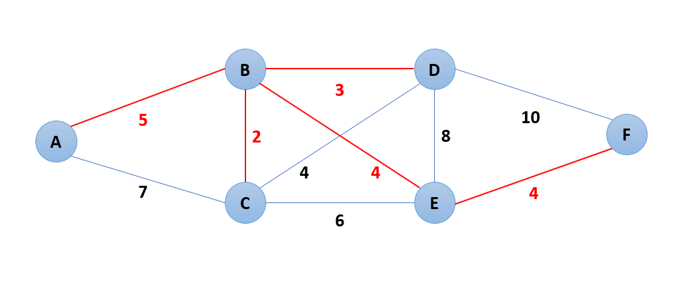

#### TestMinimumSpanningTreeSearch.test_prims_algorithm_02 (starting vertex = A)
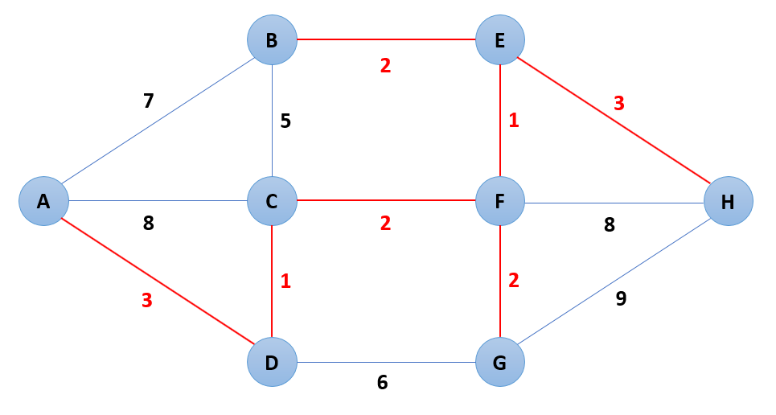

#### TestMinimumSpanningTreeSearch.test_prims_algorithm_03 (starting vertex = A)
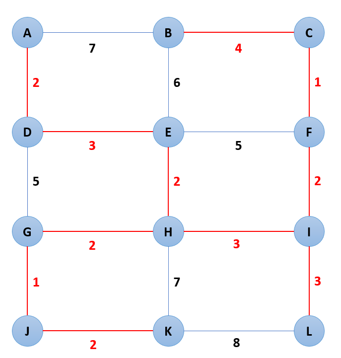

### Kruskal's Algorithm

#### TestMinimumSpanningTreeSearch.test_kruskals_algorithm_connected_graph_01
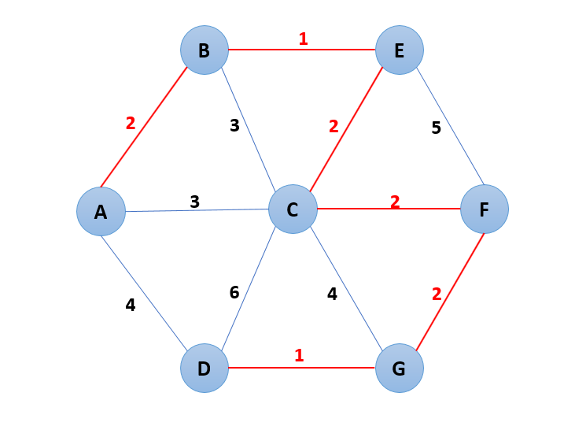

#### TestMinimumSpanningTreeSearch.test_kruskals_algorithm_connected_graph_02
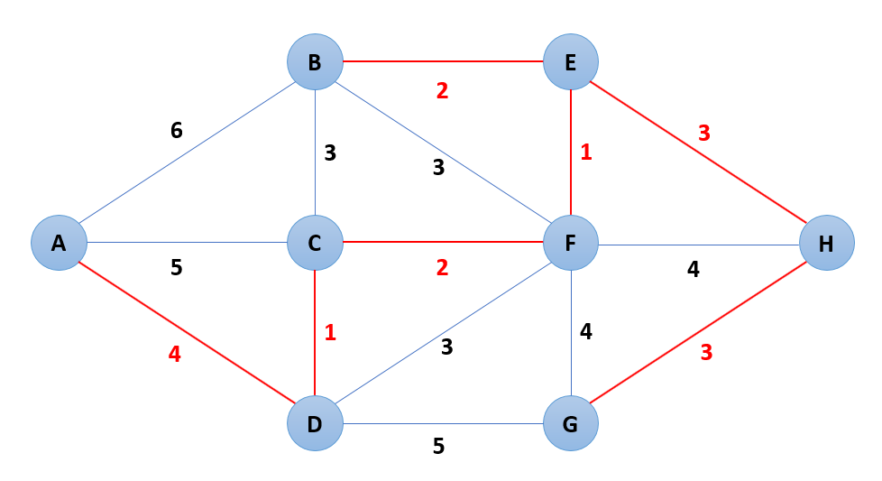

#### TestMinimumSpanningTreeSearch.test_kruskals_algorithm_connected_graph_03
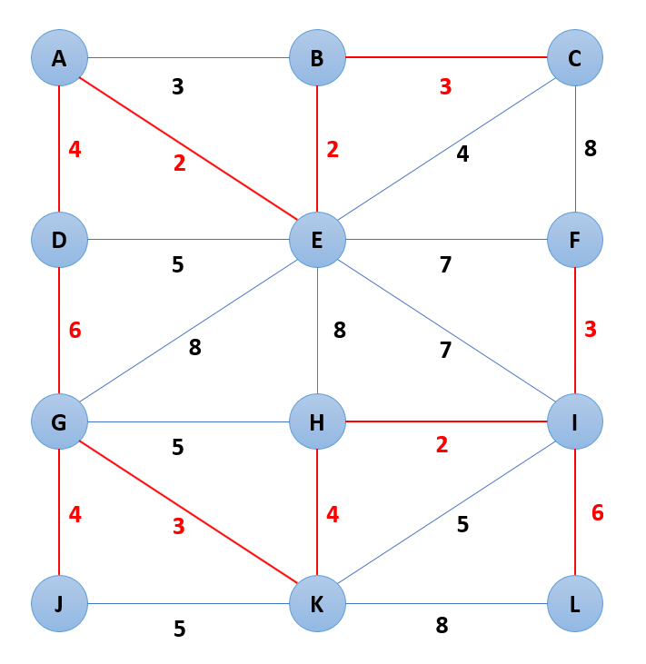

#### TestMinimumSpanningTreeSearch.test_kruskals_algorithm_connected_graph_04
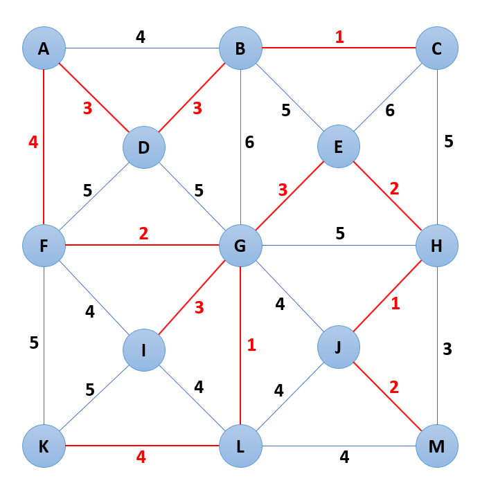

#### TestMinimumSpanningTreeSearch.test_kruskals_algorithm_disconnected_graph_01
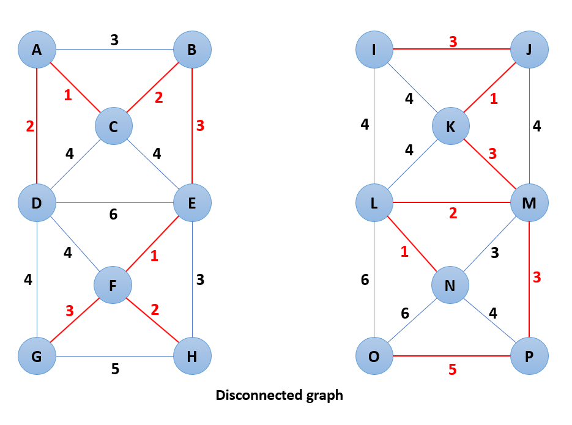

#### TestMinimumSpanningTreeSearch.test_kruskals_algorithm_disconnected_graph_02
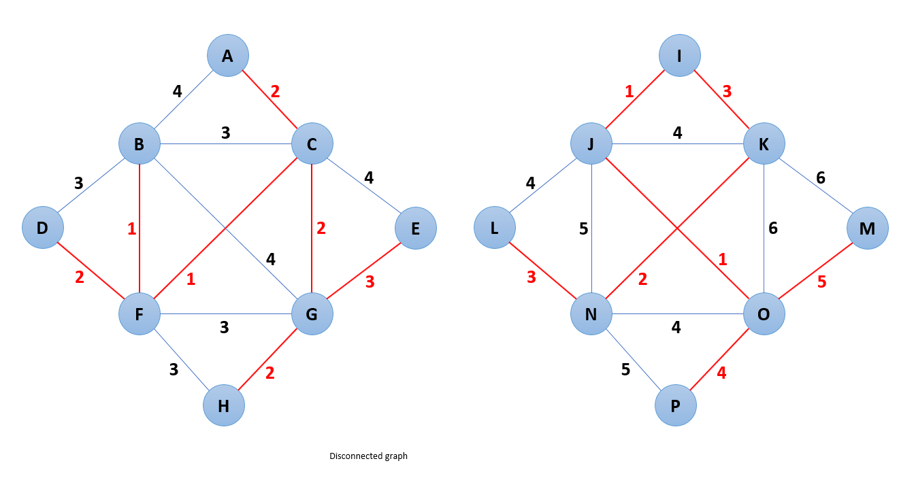
