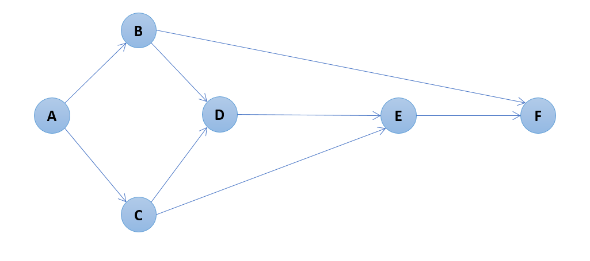

# Graphs Used by the Unit Tests

## Topological Sort

### TestTopologicalSort.test_topological_sort_returns_vertices_in_proper_order_case_01

### TestTopologicalSort.test_topological_sort_returns_vertices_in_proper_order_case_02

### TestTopologicalSort.test_topological_sort_returns_vertices_in_proper_order_case_03

### TestTopologicalSort.test_topological_sort_returns_vertices_in_proper_order_case_04

## Shortest Path Algorithm

### Unweighted Graphs

#### TestShortestPathSearchForUnweightedGraphSuiteOne

#### TestShortestPathSearchForUnweightedGraphSuiteTwo

#### TestShortestPathSearchForUnweightedGraphSuiteThree

### Weighted Graphs

#### TestShortestPathSearchForWeightedGraphSuiteOne

#### TestShortestPathSearchForWeightedGraphSuiteTwo

#### TestShortestPathSearchForWeightedGraphSuiteThree

#### TestShortestPathSearchForWeightedGraphSuiteFour

## Minimum Spanning Tree
